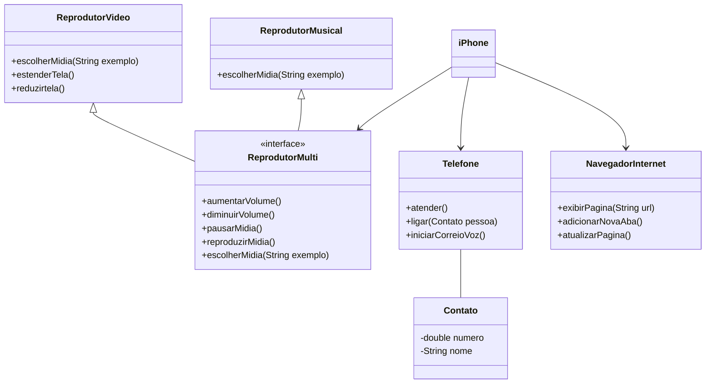

# DesafioUML

```mermaid
classDiagram
    class ReprodutorMulti{
    <<interface>>
      +aumentarVolume()
      +diminuirVolume()
      +pausarMidia()
      +reproduzirMidia()
     +escolherMidia(String exemplo)
    }

    class ReprodutorMusical {
        +escolherMidia(String exemplo)
      }

     class ReprodutorVideo {
        +escolherMidia(String exemplo)
        +estenderTela()
        +reduzirtela()
    }

    class Telefone {
        +atender()
        +ligar(Contato pessoa)
        +iniciarCorreioVoz()
    }
    class Contato{
-double numero
-String nome
}

    class NavegadorInternet {
        +exibirPagina(String url)
        +adicionarNovaAba()
        +atualizarPagina()
    }

    class iPhone {
    }

    iPhone --> ReprodutorMulti
    iPhone --> Telefone
    iPhone --> NavegadorInternet
    ReprodutorVideo <|-- ReprodutorMulti
    ReprodutorMusical <|-- ReprodutorMulti
    Telefone -- Contato
```
